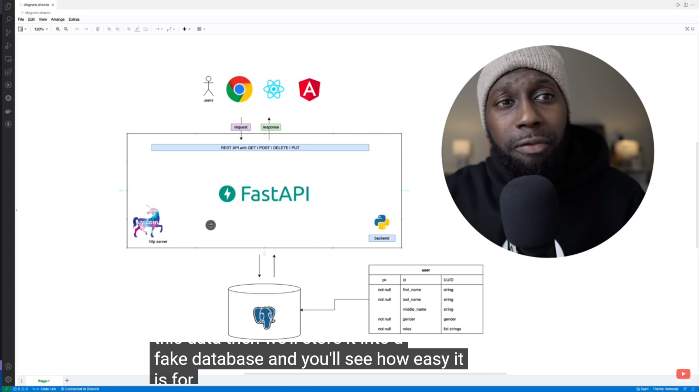
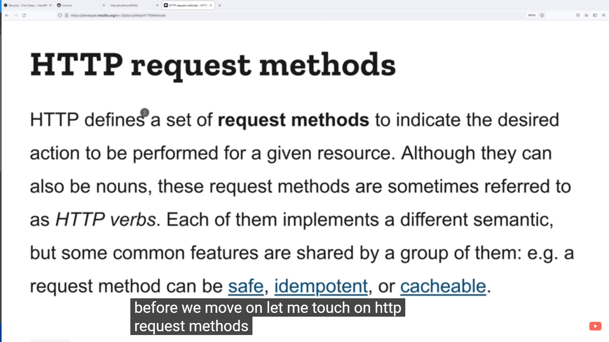

# [FastAPI Tutorial - Building RESTful APIs with Python](https://www.youtube.com/watch?v=GN6ICac3OXY)

## Links for help you in more details and questions:

### 1 - For know more about http methods, visit: [MDN Web Docs](https://developer.mozilla.org/en-US/docs/Web/HTTP/Methods)

### 2 - For know more about ASGI, visit: [ASGI Docs](https://asgi.readthedocs.io/en/latest/)

### 3 - For know more about pydantic, visit: [Pydantic Docs](https://pydantic-docs.helpmanual.io/)

### 4 - For know more about Thunder Client (Rest Client Test), visit: [Thunder Client](https://www.thunderclient.com/)

### 5.1 - Link for Swagger Docs: http://127.0.0.1:8000/docs

### 5.2 - Link for Redocs: http://127.0.0.1:8000/redoc

## How to get started this project ?!

### 1 - For install dependencies: `pip -m install requirements.txt`

### 2 - For start uvicorn HTTP server: `uvicorn main:app --reload`
